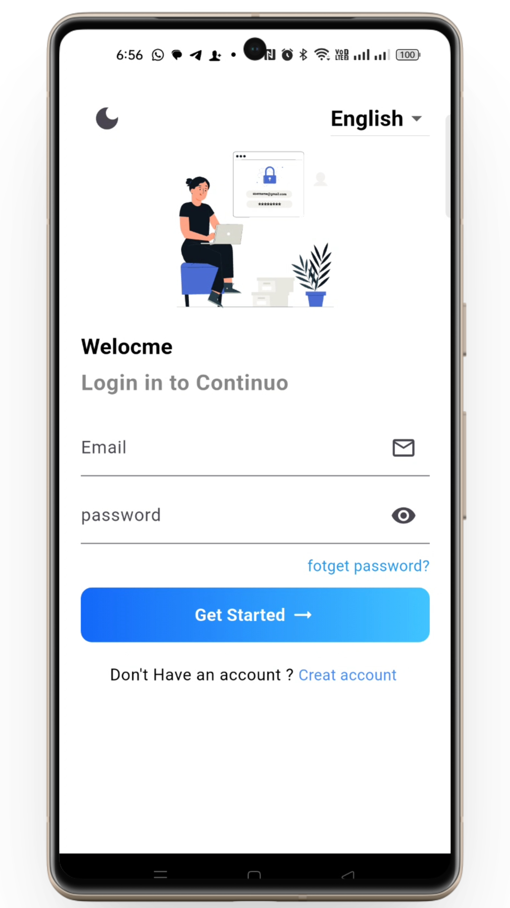
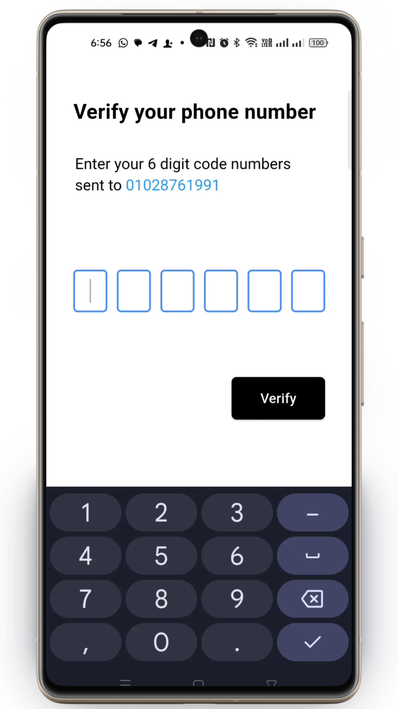
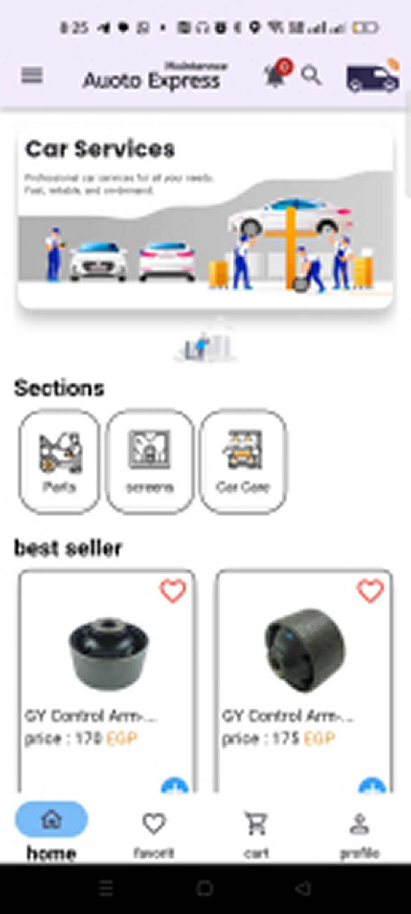
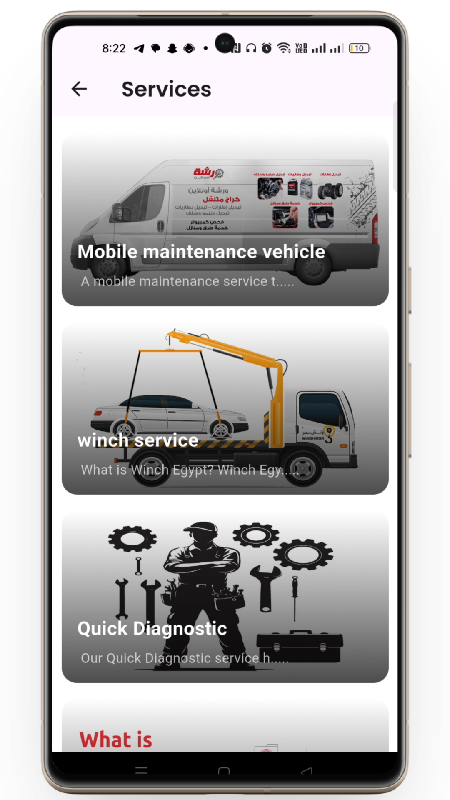
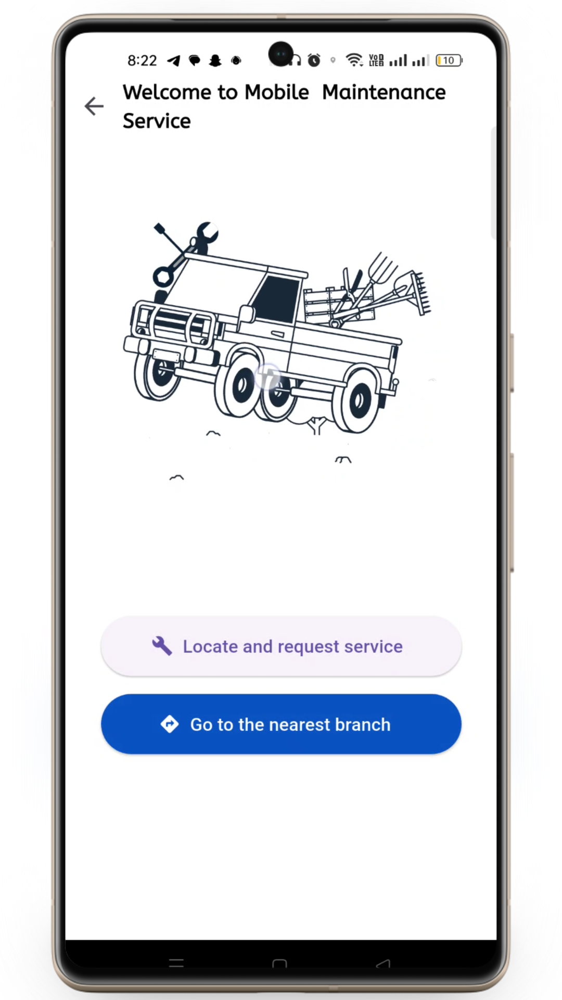
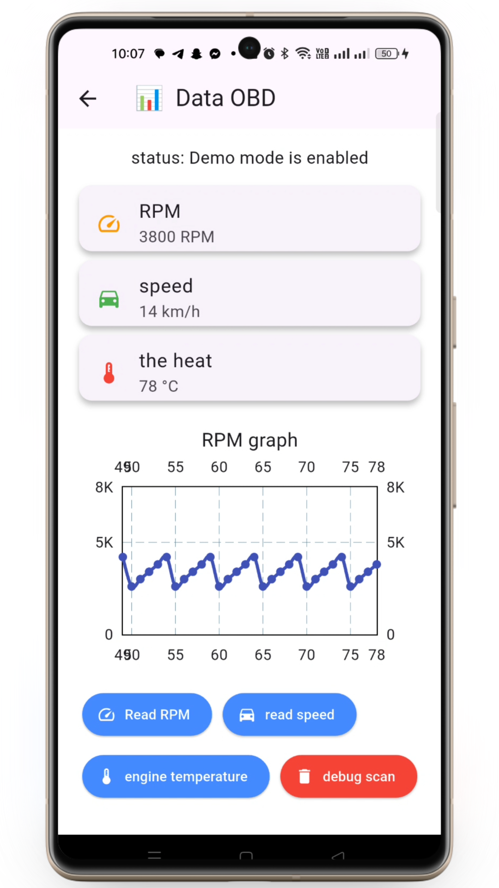
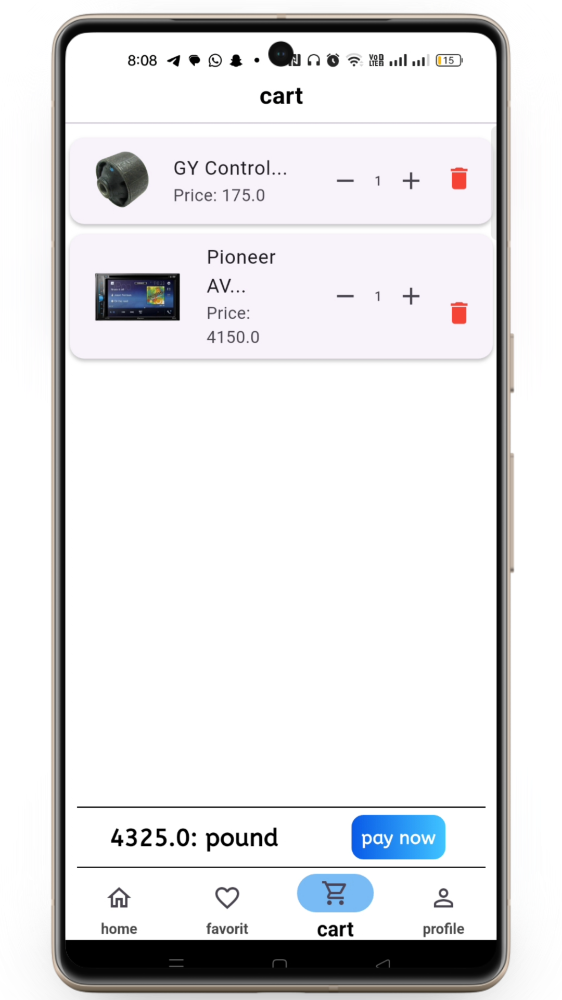
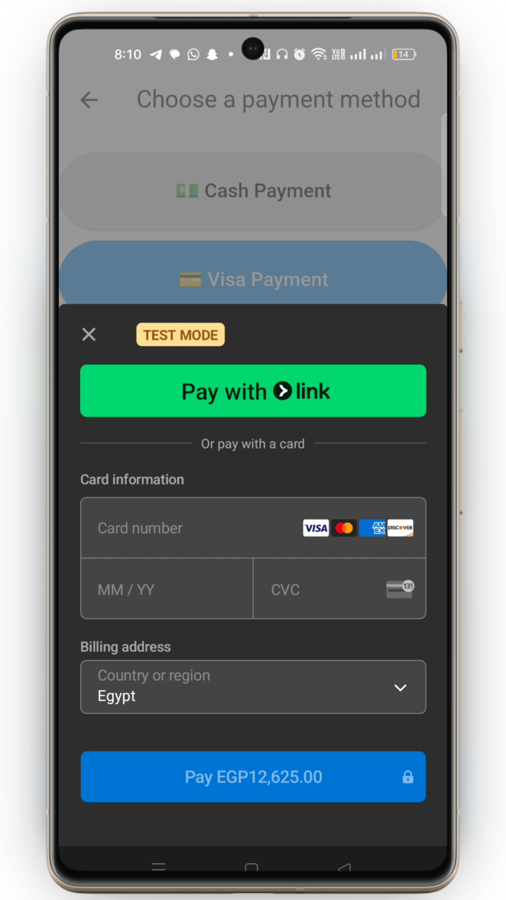

# 🚗 AutoCare Services

**AutoCare Services** is a **car services & e-commerce application** built with **Flutter**, providing on-demand **car recovery, maintenance services, spare parts, and car accessories** in one platform.  
The app integrates with a **PHP & MySQL backend**, supports **online payments**, **location services**, and is designed with **MVC architecture using GetX** for clean and scalable code.

---

## 📌 Table of Contents
- [Screenshots](#-screenshots)
- [Features](#-features)
- [Tech Stack](#-tech-stack)
- [Architecture](#-architecture)
- [State Management](#-state-management)
- [API Integration](#-api-integration)
- [Payment Integration](#-payment-integration)
- [Location Services](#-location-services)
- [Localization & Theme](#-localization--theme)
- [Performance](#-performance)

---

## 📸 Screenshots
<table>
<tr>
  <td></td>
  <td></td>
  <td></td>
  <td></td>
</tr>
</table> 
<table>
<tr>
  <td></td>
  <td></td>
  <td></td>
  <td></td>
</tr>
</table>

---

## 🚀 Features
- 🚙 **Car Services** – Recovery (Winch), maintenance, and roadside assistance  
- 🛠 **Maintenance Requests** – Book car maintenance services easily  
- 🛒 **Spare Parts & Accessories Store**  
- 💳 **Online Payments** – Secure payment integration with Stripe  
- 📍 **Location Services** – Track service location & user position  
- 🌍 **Multi-language Support** – Arabic & English  
- 🌓 **Dark Mode & Light Mode**  
- 📱 **Responsive UI** – Mobile & Tablet support  
- 🔐 **Secure API Communication**

---

## 🛠 Tech Stack
- **Flutter**
- **Dart**
- **GetX**
- **MVC Architecture**
- **REST API (PHP & MySQL)**
- **http**
- **Stripe Payment Gateway**
- **Google Maps / Location Services**
- **Localization**
- **Dark & Light Theme**

---

## 🏛 Architecture
The project follows **MVC Architecture** using **GetX**, ensuring:
- Clear separation of UI, logic, and data  
- Scalable and maintainable structure  
- Easy API handling and state updates  

---

## 🧠 State Management
Using **GetX** for:
- UI state management  
- API loading & error handling  
- Theme & language switching  
- Cart and services state  

---

## 🔌 API Integration
The app communicates with a **PHP & MySQL backend** to handle:
- User authentication  
- Services & orders  
- Spare parts & accessories  
- Payment requests  

Implemented using:
- **http** for network requests  
- Centralized API service layer  
- Error & response handling  

---

## 💳 Payment Integration
- Integrated **Stripe** for online payments  
- Secure checkout flow  
- Supports services and product purchases  

---

## 📍 Location Services
- Real-time user location  
- Service tracking on map  
- Distance-based service requests  

---

## 🌍 Localization & Theme
- Supports **Arabic & English**
- Dynamic language switching  
- **Dark Mode & Light Mode** with GetX theme handling  

---

## ⚡ Performance Boosters
- Optimized API calls  
- Efficient state updates with GetX  
- Clean widget structure  
- Smooth UI and low memory usage  

---
